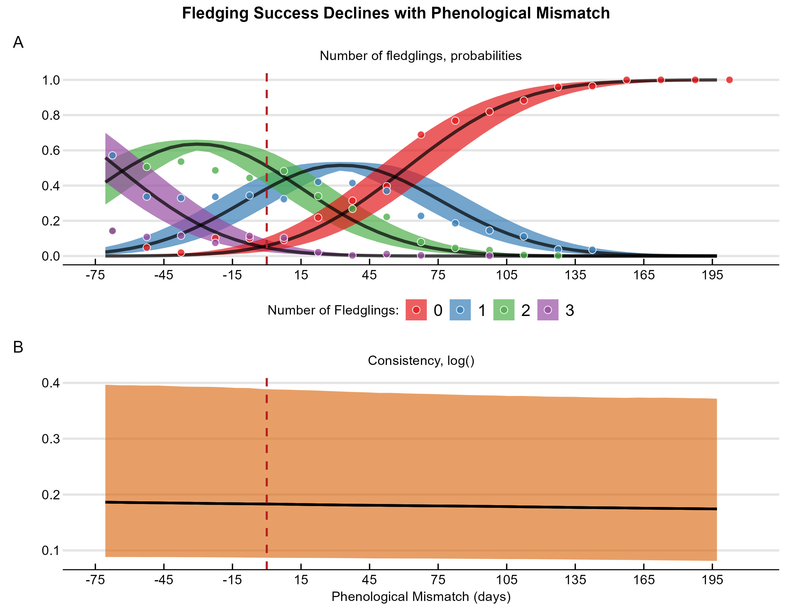
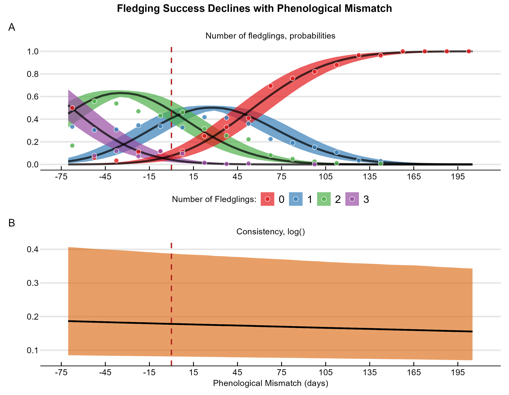

Figure Legend: In all figures, solid lines represent population-level mean predictions, with 95% credible intervals shown as shaded ribbons. Points represent raw data. For plots showing phenological mismatch against age or year, point size is proportional to the number of daily observations. For plots showing fledging success probabilities, points are the observed proportions for each fledgling count. The consistency of an outcome among individuals is measured by its standard deviation (σ), while the consistency of fledging success is measured by the ordinal discrimination parameter (ζ) on a log scale

# Females

# Males

